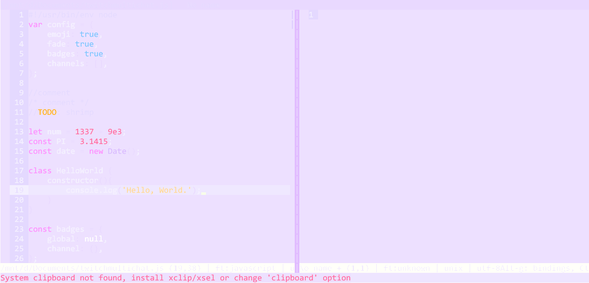

# ancient one dark  

## About  

A dark violet theme for the [micro](https://micro-editor.github.io/) editor inspired by uetchy's original [Ancient One Dark theme](https://marketplace.visualstudio.com/items?itemName=uetchy.ancient-one-dark) for Visual Studio.  
This theme uses a color palette similar to [Ninomae Ina'nis from Hololive English](https://hololive.hololivepro.com/talents/ninomae-inanis/).

## Installation  

Make sure both terminal and micro are capable and set to use the truecolor palette:  

### linux/bash

```bash
# bash:
echo 'export COLORTERM=truecolor' >> ~/.bashrc
echo 'export MICRO_TRUECOLOR=1' >> ~/.bashrc
. ~/.bashrc
```
Navigate to the config directory of micro editor (default is `$HOME/.config/micro`).  
If necessary create the directory `colorschemes` inside the config directory.  
Copy the file `ancient-one-dark-tc.micro` to `./colorschemes/`.  
Inside the editor open the command line by pressing Ctrl + E and type `set colorscheme ancient-one-dark-tc`. press Enter.  

### windows  

Set the environment variable `MICRO_TRUECOLOR` to 1. Restart the Command Prompt to apply the changes.  
Navigate to the config directory of micro editor (default is `%USERPROFILE%\.config\micro`).  
If necessary create the directory `colorschemes` inside the config directory.  
Copy the file `ancient-one-dark-tc.micro` to `.\colorschemes\`.  
Inside the editor open the command line by pressing Ctrl + E and type `set colorscheme ancient-one-dark-tc`. press Enter.  

## Screenshot




